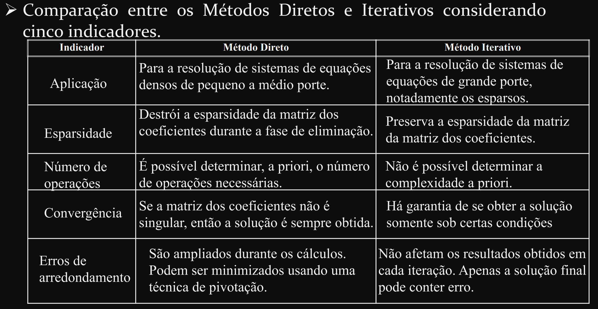

# Numerical methods

Main bibliography:
- Chapra, S., 2011. Applied Numerical Methods with MATLAB for Engineers and Scientists. McGraw Hill.

Other sources:
- Dahlquist, G. and Björck, Å., 2003. Numerical methods. Courier Corporation.: A alternative material for Chapra. Basically, it seems to the same contents as Chapra (and in the same depth level).
- Kreyszig, E., Stroud, K. and Stephenson, G., 2008. Advanced engineering mathematics: For analytical solution of ODEs (Part A, chap 1-6) and PDE (chapter 12).
- Hoffman, J.D. and Frankel, S., 2018. Numerical methods for engineers and scientists. CRC press: It seems to be a more advanced book, with a special focus on algorithms for ODEs and PDEs problems. More advanced algorithms that aren't found on Chapra might be found here.
- Goodfellow, I., Bengio, Y. and Courville, A., 2016. Deep learning. MIT press: Only the part about automatic differentiation (sec 6.5.9).

## Numerical methods summary

- [**Root-finding problems**][30]:

  Determines the values of the independent variable (or variables) at which a given function equals zero. Mathematically, these problems can be stated as finding the roots or solutions $x$ such that $f ( x ) = 0$, where $f(x)$ is a given function. As, generally, the zeros of a function cannot be computed exactly nor expressed in closed form (i.e., analytically), root-finding algorithms provide approximations to zeros, expressed either as floating-point numbers or as small isolating intervals, or disks for complex roots.
- [**ODE- and PDE-based problems**][31]:

  Given a ODE/PDE, how to solve it. The solutions to ordinary differential equations (ODEs) can be broadly categorized into two main types: analytical solutions and numerical solutions.
  - **Analytical/closed-form solution**: Exact mathematical expressions that represent the solution to the differential equation. Examples include $x(t) = \cos(t)$ for $x + x' = 0$. Analytical solutions often involve systematic methods and techniques such as separation of variables, integrating factors, variation of parameters, Laplace transforms, and others. For a more in-depth solution review, see Erwin Kreyszig, part A and C.
  - **Numerical solution**: Provide an approximation to the solution by discretizing the domain and using iterative methods. Examples include Euler's method, Runge-Kutta methods, and finite difference methods. The algorithms shown here falls in this approach.
  
  The key factor that determines which solution one should follow is the problem complexity. If the problem is simple and fall into certain class of ODE problems (e.g., separable ODEs, exact ODEs, linear ODEs, homogeneous and inhomogeneous ODEs, etc), we may solve it analytically. However, **differential equations such as those used to solve real-life problems may not necessarily be directly solvable, i.e. do not have closed form solutions. Instead, solutions can be approximated using numerical methods.**
- [**Linear systems problems**][32]:

  Direct and iterative methods to solve linear systems. This topic overlaps with the Linear Algebra contents, but focuses more on the numerical approach to solve Linear system of equations, rather than the theoterical aspects of Linear Algebra. See the [Linear Algebra][33] directory for more info.
  - Direct methods (see section 5.3 on Dahlquist or 1.3 on Hoffman):
    - LU decomposition;
    - Gauss Elimination;
    - Gauss-Jordan Elimination;
    - Inverse matrices;
    - Cholesky Decomposition
  - Iterative methods (see section 5.6 on Dahlquist or 1.6 on Hoffman):
    - Gauss-Seidel method;
    - Jacobi method;
    - Successive overrelaxation (SOR) method.

- [**Curve-fitting problems**][34]: Interpolation, regression, approximation, smoothing.

  "Curve fitting" is an umbrella term that encompasses various techniques, including "regression," "smoothing," and "interpolation:
  - **[Interpolation][35]**: Interpolation is a mathematical problem that involves estimating unknown values that fall between known values. In other words, it is the process of constructing a function or curve that passes through a given set of data points (see chapter 17 and 18 on Chapra). Common types of interpolations are linear, polynomial, spline, and piecewise constant interpolators.
  - [**Regression**][36]: statistical technique to model the relationships between a dependent variable (often called the 'outcome' or 'response' variable, or a 'label' in machine learning parlance) and one or more independent variables (often called 'predictors', 'covariates', 'explanatory variables' or 'features'). The most common form of regression analysis is linear regression, in which one finds the line (or a more complex linear combination) that most closely fits the data according to a specific mathematical criterion.
  - [**Smoothing**][38]: a technique used in curve fitting to reduce noise or fluctuations in a dataset, revealing the underlying trend. It is closely related to digital signal filtering techniques, as it employs such algorithms to smooth the signals. Hence, it is not exposed here (see digital signal processing or statistical signal processing for a better understanding of these techniques. [Here][38] you can can a quick guide of algorithms that are used to function smoothering.

## Packages
- **Root-finding functions** (see Part II on Chapra, chapter 6 and 7)
  - [`Roots.jl`][7]:
    - Bisection-like algorithms (the most classic bracket method, see section 5.4)
      - See this [tutorial][16]
    - Newton's method
      - See this [tutorial][15]
    - Chebyshev (it does not have on Chapra)
    - Schroder (it does not have on Chapra)
    - QuadraticInverse (it does not have on Chapra)
- **ODE-based problems** (see Part VI on Chapra)
  - [`DifferentialEquations.jl`][1]: Numerically solving differential equations written in `julia`. See [all ODE solvers][8]; [recommendation for each situation][9]
    - Runge-Kutta Methods (see 22.4 on Chapra and [wiki][19])
    - Midpoint (see section 22.3.2 on Chapra)
    - Heun (see section 22.3.1 on Chapra)
    - Forward Euler method (see section 22.2 on Chapra)
    - Multistep Methods (see section 23.2 on Chapra)
- **Linear system problems** (see Part III on Chapra)
  - [`IterativeSolvers.jl`][2]: Iterative algorithms for solving linear systems, eigensystems, and singular value problems. Iterative methods constranst with the direct methods (e.g., Gauss elimination), which requires a finite number of steps to solve a linear system. Examples:
    - Gauss-Seidel method (an interative method for solving linear systems, see chapter 12 on Chapra)
    - Jacobi iteration method (see section 12.1 on Chapra)
- **Numerical integration** (see part V on Chapra) 
  - [`NumericalIntegration.jl`][3]: Simple (maybe not so reliable) numerical integration methods
    - Trapezoidal (default) (See section 19.3 on Chapra)
    - TrapezoidalEven
    - TrapezoidalFast
    - TrapezoidalEvenFast
    - SimpsonEven (See section 19.4 on Chapra)
    - SimpsonEvenFast
    - RombergEven (see 20.2 on Chapra)
  - [`Integrals.jl`][4]: A more reliable numerical integration methods (maybe not all methods are exposed in Chapra)
    - Gauss–Kronrod quadrature formula (a variant of Gaussian quadrature, see [wiki][27])
    - H-Adaptive Integration (Adaptive quadrature? If so, see section 20.4 on Chapra). It uses [`HCubature.jl`][5], which is a `julia` code for the [adaptive multidimensional integration][6]
    - Monte Carlo integration (apparently it doesn't have on Chapra)
    - Gauss-Legendre quadrature (see section 20.3 on Chapra)
    - `integral()` in matlab uses adaptive quadrature (see section 20.4 on Chapra)
- **Numerical differentiation (finite differences)** (see part V on Chapra)
  - [FiniteDifferences.jl][10] and [FiniteDiff.jl][11] are similar libraries: both calculate approximate derivatives numerically.
    - Backward, forward, and central numerical differentiations (see section 4.3 on Chapra, for high-order numerical differentiation, see chap 21).
- **Automatic differentiation (auto-differentiation, autodiff, or AD)** (see [wiki][13])
  - Automatic Differentiation is a more advanced technique that computes derivatives of a function accurately and efficiently by breaking down the function's operations into elementary operations and applying the chain rule of calculus.
  - [ForwardDiff.jl][14]: implements methods to take derivatives, gradients, Jacobians, Hessians, and higher-order derivatives of native Julia functions (or any callable object, really) using forward mode automatic differentiation (AD).
  - [ReverseDiff.jl][22]: A similar package to `ForwardDiff.jl` (see the differences in the `README.md`).
- **Curve fitting**
  - [`Interpolations.jl`](https://github.com/JuliaMath/Interpolations.jl)
  - [`DataInterpolations.jl`](https://github.com/SciML/DataInterpolations.jl)
    - Linear interpolation
    - Quadratic interpolation
    - Lagrange interpolation
    - Quadratic spline
    - Cubic spline

---

## Other resources:
- [Awesome STEM academy]
- [Direct vs. iterative methods][20] for solution of linear systems:
  - [advantages and disavantages][21]
  - [wiki: a nice example][28]
- [Wiki: Ordinary and partial differential equations: Explicit vs. implicit methods][17]
- [Wiki: key performance indicators in numerical analysis][18]
- [Wiki: Automatic vs. numerical vs. symbolic differentiation][29]
- A Hands-on Introduction to Automatic Differentiation towards deep learning - Part [1][23] and Part [2][24]
- `./nootebook/` contains a series of `.ipynb` with tutorials for the `DifferentialEquations.jl` package, which was found in [SciMLTutorials.jl][25] (this repo is deprecated, but the notebooks still useful). See his video tutorial on [Youtube][26]

    
[1]: https://docs.sciml.ai/DiffEqDocs/latest/
[2]: https://iterativesolvers.julialinearalgebra.org/dev/
[3]: https://github.com/dextorious/NumericalIntegration.jl
[4]: https://docs.sciml.ai/Integrals/stable/
[5]: https://github.com/JuliaMath/HCubature.jl
[6]: https://github.com/stevengj/cubature
[7]: https://juliamath.github.io/Roots.jl/stable/
[8]: https://docs.sciml.ai/DiffEqDocs/stable/solvers/ode_solve/
[9]: https://docs.sciml.ai/DiffEqDocs/stable/#Solver-Algorithms
[10]: https://github.com/JuliaDiff/FiniteDifferences.jl
[11]: https://github.com/JuliaDiff/FiniteDiff.jl
[12]: https://juliadiff.org/
[13]: https://en.wikipedia.org/wiki/Automatic_differentiation
[14]: https://juliadiff.org/ForwardDiff.jl/stable/
[15]: https://www.matecdev.com/posts/julia-newton-raphson.html
[16]: https://www.matecdev.com/posts/julia-bisection.html
[17]: https://en.wikipedia.org/wiki/Explicit_and_implicit_methods
[18]: https://en.wikipedia.org/wiki/Numerical_methods_for_ordinary_differential_equations#Analysis
[19]: https://en.wikipedia.org/wiki/Runge%E2%80%93Kutta_methods
[20]: https://www.linkedin.com/advice/0/how-do-you-compare-combine-direct-iterative
[21]: http://www.decom.ufop.br/moreira/site_media/uploads/arquivos/01_selas_new.pdf
[22]: https://github.com/JuliaDiff/ReverseDiff.jl
[23]: https://mostafa-samir.github.io/auto-diff-pt1/
[24]: https://mostafa-samir.github.io/auto-diff-pt2/
[25]: https://github.com/SciML/SciMLTutorials.jl
[26]: https://www.youtube.com/watch?v=KPEqYtEd-zY&ab_channel=TheJuliaProgrammingLanguage
[27]: https://en.wikipedia.org/wiki/Gauss%E2%80%93Kronrod_quadrature_formula
[28]: https://en.wikipedia.org/wiki/Numerical_analysis#Direct_and_iterative_methods
[29]: https://en.wikipedia.org/wiki/Automatic_differentiation#Difference_from_other_differentiation_methods
[30]: https://en.wikipedia.org/wiki/Root-finding_algorithms
[31]: https://en.wikipedia.org/wiki/Differential_equation#:~:text=An%20ordinary%20differential%20equation%20(ODE,%2C%20therefore%2C%20depends%20on%20x.
[32]: https://en.wikipedia.org/wiki/Numerical_linear_algebra
[33]: https://github.com/tapyu/courses/tree/main/linear-algebra
[34]: https://en.wikipedia.org/wiki/Curve_fitting
[35]: https://en.wikipedia.org/wiki/Interpolation
[36]: https://en.wikipedia.org/wiki/Regression_analysis
[37]: https://en.wikipedia.org/wiki/Smoothing
[38]: https://en.wikipedia.org/wiki/Smoothing#Algorithms
[Awesome STEM academy]: https://github.com/tapyu/awesome-stem-academy/tree/main#numerical-methods
